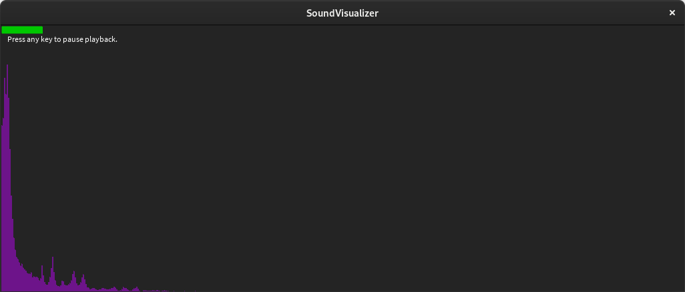

## Processing Sound Visualizer

Use [Processing](https://processing.org/download/) to compile and run the application.

Create a "data" folder inside the sketch folder and place the music file inside with the name "song.mp3".

You also need to download the _minim_ library from the editor.

